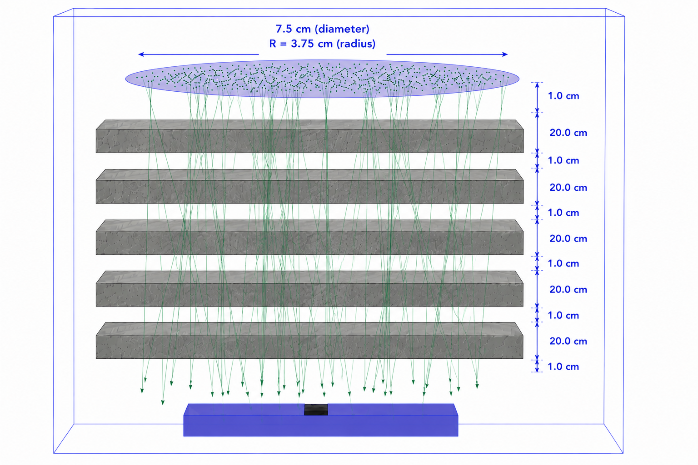

# MuNRA Geant4 Simulation

Geant4 simulation of the MuNRA plastic scintillator detector developed during a research internship at the Laboratory for Research and Development of Radiation and Astroparticle Detectors (LIDeRA), Universidad Industrial de Santander (UIS), Colombia.

The simulation was developed to study the response of the MuNRA detector to atmospheric secondary particles and to investigate particle-flux attenuation through concrete layers.

The repository also contains the Python script used for experimental data acquisition and the Jupyter notebook used for the analysis of the experimental and simulated data presented in the final internship report.

## Overview

The detector model consists of:

- an 8 × 4 × 1 cm³ polystyrene scintillator;
- optical scintillation processes;
- aluminium reflective wrapping;
- a 6 × 6 mm² silicon photomultiplier (SiPM);
- wavelength-dependent SiPM photon detection efficiency.

The optical properties of the scintillator include its emission spectrum, absorption length, refractive index, scintillation yield and decay time.

The simulation geometry used for the attenuation study is shown below.

<p align="center">
  
</p>

## Atmospheric particle source

Atmospheric secondary particles are provided by an ARTI/CORSIKA `.shw` file.

For each particle, the simulation reads:

- CORSIKA particle ID;
- momentum components (`px`, `py`, `pz`);
- shower information;
- primary-particle information.

The CORSIKA particle ID is converted to the corresponding Geant4 particle definition, and the kinetic energy and direction are reconstructed from the momentum components.

Particles are generated uniformly over a circular source above the detector.

A small example ARTI input file (`bga_example.shw`) containing 20 particle entries is provided to illustrate the expected input format. The complete one-hour ARTI dataset used for the simulations is not included in this repository because of its size.

## Concrete attenuation

Concrete slabs can be placed between the particle source and the detector to study the attenuation of the atmospheric particle flux.

Each slab has dimensions:

`50 × 50 × 20 cm³`

with a 1 cm air gap between successive slabs.

The number of concrete layers and the source height were varied between simulations in order to reproduce different material thicknesses while maintaining the appropriate source-detector geometry.

## Simulation output

Two output files are generated during a simulation:

### `results.csv`

Contains event-level information:

- event ID;
- energy deposited in the scintillator;
- number of photons detected by the SiPM;
- first detected photon time;
- mean detected photon time;
- detection flag.

### `pulse.csv`

Contains the temporal distribution of detected optical photons for each event.

## Experimental data acquisition

The `acquisition/` directory contains the Python script used to record data simultaneously from the two MuNRA detector units during the experimental campaign.

The script reads the two serial outputs in parallel and stores the data from each detector in a separate text file.

Example for a two-hour acquisition:

```bash
python3 capture.py /dev/ttyACM0 out1.txt /dev/ttyACM1 out2.txt 7200
```

where:

- `/dev/ttyACM0` and `/dev/ttyACM1` are the serial ports of the two detectors;
- `out1.txt` and `out2.txt` are the corresponding output files;
- `7200` is the acquisition duration in seconds.

Further information is provided in `acquisition/README.md`.

## Data analysis

The `analysis/` directory contains the cleaned Jupyter notebook corresponding to the analyses used to produce the main quantitative results presented in the final internship report.

The notebook `MuNRA_Report_Analysis_Clean.ipynb` includes:

- detector characterization using a Cs-137 source;
- lead-shielding measurements;
- detector-orientation measurements;
- long-term detector stability;
- atmospheric-particle counting rates at different building storeys;
- relative transmission measurements;
- Geant4/ARTI attenuation analysis;
- geometrical correction of the simulated attenuation;
- comparison between experimental measurements and Geant4/ARTI simulations;
- coincidence counting-rate analysis.

## Data availability

The complete experimental acquisition datasets and Geant4 simulation output files are not included in this repository because of their size.

The repository provides the simulation, acquisition and analysis codes required to reproduce the workflow. A small ARTI/CORSIKA input file (`bga_example.shw`) is included as an example of the particle-source format.

## Repository structure

```text
.
├── acquisition/
│   ├── README.md
│   └── capture.py
│
├── analysis/
│   └── MuNRA_Report_Analysis_Clean.ipynb
│
├── figures/
│   └── SimulationGeometry.png
│
├── include/                # Header files
├── src/                    # Geant4 source files
├── bga_example.shw         # Example ARTI/CORSIKA input
├── CMakeLists.txt          # CMake configuration
├── exampleB1.cc            # Main application
├── runProduction.mac       # Production run macro
├── init_vis.mac            # Visualization initialization
├── vis.mac                 # Visualization macro
└── README.md
```

## Main simulation files

- `DetectorConstruction.cc`: detector geometry, materials, optical properties and concrete layers.
- `PrimaryGeneratorAction.cc`: ARTI/CORSIKA particle input and primary-particle generation.
- `EventAction.cc`: event-level quantities and output files.
- `RunAction.cc`: run-level initialization and accumulated quantities.
- `SteppingAction.cc`: particle tracking and optical-photon detection.
- `ActionInitialization.cc`: registration of the Geant4 user actions.

## Software

The simulation was developed using Geant4 and is based on the structure of the Geant4 B1 example.

Experimental data acquisition and analysis were performed using Python. The final data-analysis workflow is provided as a Jupyter notebook.

## Author

Alyah Abdellaoui-Masquelier  
Université Paris Cité  
Research internship at LIDeRA – Universidad Industrial de Santander, 2026
